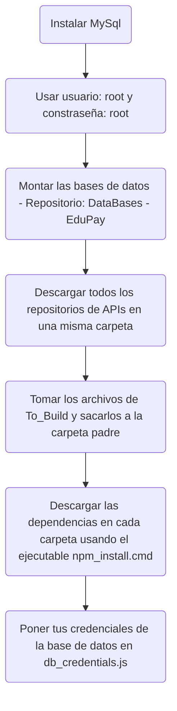
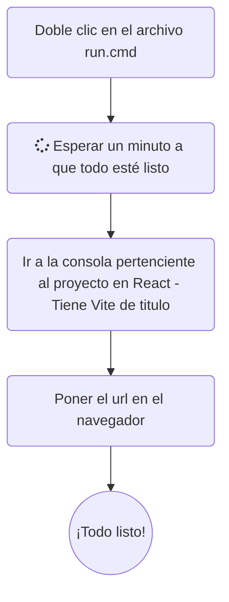

# 

Plataforma de pagos en linea para institución de educación superior.

## Construcción

<h3 align="center"> Tu carpeta debería verse así </h3>

  

  

## Arquitectura 🌐

## Base de datos (Sistema institucional) 🏫

## Base de datos (Sistema de bancos) 🏦

## API Gateway 🚚 ([Documentación](https://github.com/Diseno-de-Software-2/API-Gateway-EduPay#readme))

## Servicio de consultas ❔

## Servicos de cuentas 🧑

## Servicio de pago 💵

## Servicio de autorización 🔒

## Servicio de consulta de saldos 💸  ([Documentación](https://github.com/Diseno-de-Software-2/Balance-API-EduPay#readme))

## API de bancos 🏧

<!--

-->

<!--

**Here are some ideas to get you started:**

🙋‍♀️ A short introduction - what is your organization all about?
🌈 Contribution guidelines - how can the community get involved?
👩‍💻 Useful resources - where can the community find your docs? Is there anything else the community should know?
🍿 Fun facts - what does your team eat for breakfast?
🧙 Remember, you can do mighty things with the power of [Markdown](https://docs.github.com/github/writing-on-github/getting-started-with-writing-and-formatting-on-github/basic-writing-and-formatting-syntax)
-->
