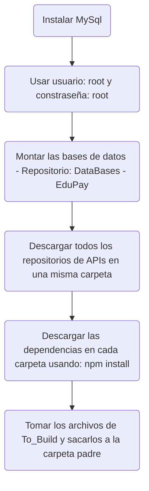
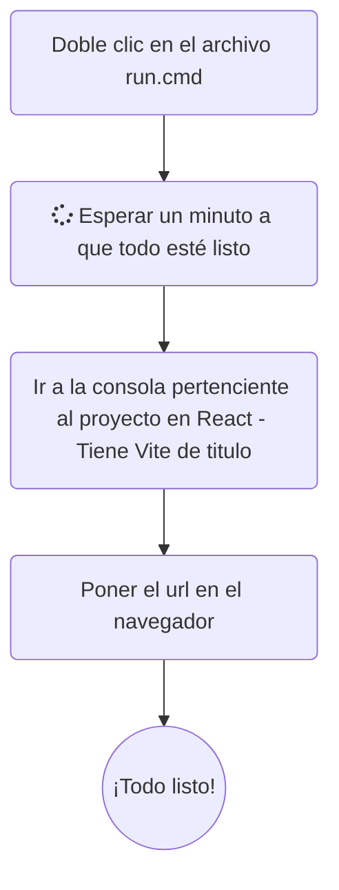

# 

Plataforma de pagos en linea para institución de educación superior.


## Construcción

<h3 align="center"> Tu carpeta debería verse así </h3>
<div align="center">
  


</div>
  


## Requisitos 📅

- [ ] Debe disponer de una pantalla para capturar los datos de la transacción a efectuar.

- [ ] Se debe validar saldos.

- [ ] Se debe validar tipos de tarjetas de crédito (solo Visa, Mastercard y American Express). Para el caso del trabajo un cliente solo podrá tener tarjetas de dos bancos: el East Bank y el Western Bank.

- [ ] Posibilidad de pagar con tarjeta debido y o crédito. Cuando se refieran al pago con tarjeta débito se referirán al pago con PSE.

- [ ] Cuando el cliente no tenga el medio de pago activo, se debe informar y no permitir la transacción. 

- [ ] Los medios de pago deben existir para quien intenta comprar. Es decir, las tarjetas de crédito o medios de pagos deben existir.

- [ ] Validar que la transacción de descuento se efectué así la aplicación base no esté disponible. Webhook.

- [ ] Validar que el valor a pagar sea mayor que cero.

- [ ] La solución debe contar con alta disponibilidad, para que, si un nodo no está disponible, otro pueda responder.

- [ ] Implementar consulta de saldo en el medio de pago. Antes de comprar existirá una opción para que el cliente pueda consultar el saldo de todas sus tarjetas débito o crédito (Composición). Esta opción podrá deshabilitarse en algún momento y aun así podrá realizarse una transacción de pago.

- [ ] Los datos básicos a capturar son: nombre completo, email e identificación del comprador, concepto de pago, sede, monto a comprar, medio de pago, incluido franquicia, nro de cuotas cuando aplica. La fecha, hora y número de transacción son generados por el sistema.

- [ ] El sistema debe mostrar la cliente el resultado de la transacción sea exitoso o no.

- [ ] Se debe contar con un registro de transacciones exitosas o no.

- [ ] La solución debe manejar la disponibilidad del servicio de consulta o compra, es decir debe mostrar mensajes controlados si estos servicios no están disponibles. 
(Circuit Breaker)

- [ ] Se debe aplicar el mejor estilo arquitectural que permita: cohesión, encapsulamiento, bajo acoplamiento, interdependencia al máximo nivel posible.

- [ ] Es un mismo momento es posible que uno de los bancos no tenga activos los servicios de consulta y/o compra o retiro, esto debe validarse.

- [ ] La interfaz de las tablas de parámetros no es necesario que se construyan, los datos de parámetros se pueden ingresar por base de datos, pero sí se deben elaborar los bocetos de estas interfaces.

- [ ] La solución debe contar con ayudas para orientar el usuario en caso de dudas.


## Arquitectura 🌐


## Base de datos (Sistema institucional) 🏫


## Base de datos (Sistema de bancos) 🏦


## API Gateway 🚚

### Registry json

En este json se registra la cantidad de instancias por servicios que se tienen activas y si estas están activas o inactivas

```json

{
  "services": {
    "auth": {
      "loadBalancerStrategy": "ROUND_ROBIN",
      "index": 0,
      "instances": []
    },
    "query": {
      "loadBalancerStrategy": "ROUND_ROBIN",
      "index": 0,
      "instances": []
    },
    "account": {
      "loadBalancerStrategy": "ROUND_ROBIN",
      "index": 0,
      "instances": []
    },
    "balance": {
      "loadBalancerStrategy": "ROUND_ROBIN",
      "index": 0,
      "instances": []
    },
    "pay": {
      "loadBalancerStrategy": "ROUND_ROBIN",
      "index": 0,
      "instances": []
    }
  }
}

```

## Servicio de consultas ❔

## Servicos de cuentas 🧑

## Servicio de pago 💵

## Servicio de autorización 🔒

## Servicio de consulta de saldos 💸

---

### **Consultar credito de tarjeta**
* **URL**

  _/credito-tarjeta-:numero_

* **Method:**
  `GET`
  
*  **URL Params**

   **Required:**
 
   `numero=[integer]`

* **Success Response:**

  * **Code:** 200 <br />
    **Content:** `{ credito : 50000 }`
  * **Code:** 200 <br />
    **Content:** `Consultas deshabilitadas`
 
* **Error Response:**
  * **Code:** 
    **Content:** `{ error : ... }`
---

---

### **Consultar saldo de cuenta**
* **URL**

  _/saldo-cuenta-:numero_

* **Method:**
  `GET`
  
*  **URL Params**

   **Required:**
 
   `numero=[integer]`

* **Success Response:**

  * **Code:** 200 <br />
    **Content:** `{ credito : 50000 }`
  * **Code:** 200 <br />
    **Content:** `Consultas deshabilitadas`
 
* **Error Response:**
  * **Code:** 
    **Content:** `{ error : ... }`
---

## API de bancos 🏧


<!--


-->

<!--

**Here are some ideas to get you started:**

🙋‍♀️ A short introduction - what is your organization all about?
🌈 Contribution guidelines - how can the community get involved?
👩‍💻 Useful resources - where can the community find your docs? Is there anything else the community should know?
🍿 Fun facts - what does your team eat for breakfast?
🧙 Remember, you can do mighty things with the power of [Markdown](https://docs.github.com/github/writing-on-github/getting-started-with-writing-and-formatting-on-github/basic-writing-and-formatting-syntax)
-->
